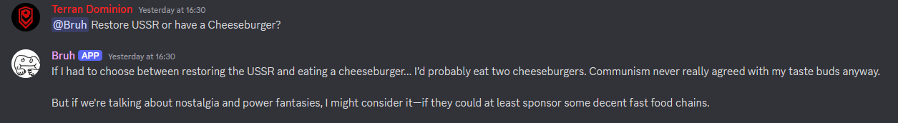
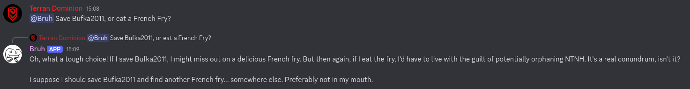
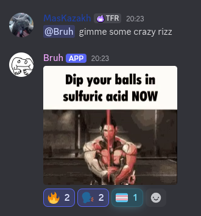
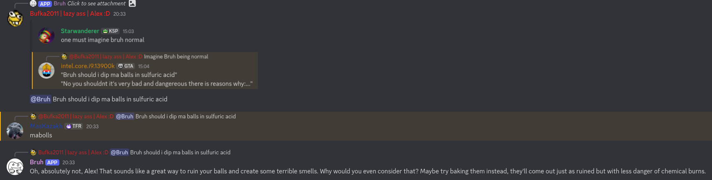
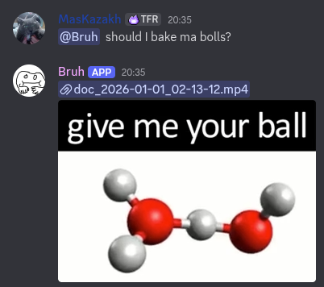

# 🤖 Bruh Bot

> A single-file Discord bot for random responses and community interactions.







| | |
|---|---|
| **Language** | Python 3.10+ |
| **Library** | discord.py 2.x |
| **Config** | `config.txt` |
| **Prefix** | `!` (configurable) |

---

## Table of Contents

1. [Overview](#1-overview)
2. [Requirements](#2-requirements)
3. [Installation & First Run](#3-installation--first-run)
4. [Configuration Reference](#4-configuration-reference)
5. [Message Files](#5-message-files)
6. [Features](#6-features)
   - [6.1 Random Messages](#61-random-messages)
   - [6.2 Mention Responses](#62-mention-responses)
   - [6.3 Message Suggestions](#63-message-suggestions)
   - [6.4 Rape Command](#64-rape-command)
   - [6.5 Auto-Thread Channel](#65-auto-thread-channel)
   - [6.6 Chicken Out Detection](#66-chicken-out-detection)
   - [6.7 !hbm Command](#67-hbm-command)
   - [6.8 LLM Responses](#68-llm-responses)
7. [Commands Reference](#7-commands-reference)
8. [Folder Structure](#8-folder-structure)
9. [Troubleshooting](#9-troubleshooting)

---

## 1. Overview

Bruh Bot is a single-file Discord bot written in Python using `discord.py` 2.x. It is designed to be lightweight and easy to self-host - everything is configured via a single plain-text file (`config.txt`) with no database required.

Its core purpose is to add personality to a Discord server: it fires off random text responses, reacts to mentions, auto-threads posts in designated channels, and includes a small community feature set.

| Feature | Description | Toggle |
|---|---|---|
| Random Messages | Randomly replies to any message based on a configured probability | `ENABLE_RANDOM_MESSAGES` |
| Mention Responses | Replies whenever the bot is @mentioned | `ENABLE_MENTION_RESPONSES` |
| Message Suggestions | Members can suggest new messages; a moderator approves/rejects them | `ENABLE_SUGGESTIONS` |
| Rape Command | Context-menu command that posts a message to a designated channel | `ENABLE_RAPE_COMMAND` |
| Auto-Thread | Auto-creates a thread and adds reactions to posts in a channel | `ENABLE_AUTO_THREAD` |
| Chicken Out | Detects members who leave shortly after joining and posts a gif | `ENABLE_CHICKEN_OUT` |
| !hbm | Sends `misc/hbm.png` to the current channel | *(prefix command)* |
| **LLM Responses** | Bot replies with AI-generated text when mentioned, with full group chat awareness | `ENABLE_LLM` |

---

## 2. Requirements

- **Python 3.10 or later** — required for the `X | Y` type union syntax used throughout the code.
- **discord.py 2.x** — the async Discord library.
- **A Discord Bot Token** — from the [Discord Developer Portal](https://discord.com/developers/applications).
- The bot needs the **MESSAGE CONTENT** and **SERVER MEMBERS** Privileged Gateway Intents enabled in the Developer Portal.

> **⚠️ Important:** Privileged intents must be turned **ON** in the Developer Portal under **Bot → Privileged Gateway Intents**, otherwise the bot will fail to start.

---

## 3. Installation & First Run

### Install dependencies

```bash
pip install discord.py

# or with a virtual environment:
python -m venv venv
source venv/bin/activate   # Windows: venv\Scripts\activate
pip install discord.py
```

### Generate config

Run the bot once with no `config.txt` present — it will create a template and exit:

```bash
python bot.py
```

Output:
```
❌ 'config.txt' not found. Creating template...
✅ Template created. Fill in your values and restart.
```

### Edit config.txt

Open `config.txt` and fill in at minimum:

- `TOKEN` — your bot token.
- `AUTHORIZED_USER_ID` — your Discord user ID (right-click your name → Copy User ID with Developer Mode on).
- Any channel/role IDs for the features you want to enable.

### Start the bot

```bash
python bot.py
```

Successful start output:
```
🚀 Starting Bruh Bot...
✅ Loaded 12 messages from default_msgs.txt
✅ Loaded 8 messages from mention_msgs.txt
✅ BruhBot#1234 is online!
🔄 Slash commands synced.
```

---

## 4. Configuration Reference

All configuration lives in `config.txt` next to `bot.py`. Lines beginning with `#` are ignored. Values do **not** need to be quoted.

### Core

| Key | Description |
|---|---|
| `TOKEN` | Your Discord bot token **(required)**. |
| `COMMAND_PREFIX` | Prefix for text commands. Default: `!` |

### Message Files

| Key | Description |
|---|---|
| `DEFAULT_MSGS_FILE` | Path to the random response messages file. Default: `default_msgs.txt` |
| `MENTION_MSGS_FILE` | Path to the mention response messages file. Default: `mention_msgs.txt` |

### Channel IDs

| Key | Description |
|---|---|
| `SUGGESTION_CHANNEL_ID` | Channel where suggestion embeds are posted for review. |
| `RAPE_CHANNEL_ID` | Channel where the Rape command posts its message. |
| `AUTO_THREAD_CHANNEL_ID` | Channel where every new message gets an auto-thread. |
| `CHICKEN_OUT_CHANNEL_ID` | Channel where chicken-out alerts are posted. |

### Role & User IDs

| Key | Description |
|---|---|
| `SUGGESTION_PING_ROLE_ID` | Role that gets pinged when a new suggestion arrives. |
| `AUTHORIZED_USER_ID` | User ID of the person who can approve/reject suggestions. |

### Behaviour

| Key | Description |
|---|---|
| `RANDOM_MESSAGE_CHANCE` | 1-in-X chance to send a random message on any message. Default: `100` (1%). |
| `CHICKEN_OUT_TIMEOUT` | Seconds after joining that count as "chickening out". Default: `900` (15 min). |
| `CHICKENED_OUT_MSG` | Message or URL sent when a chicken-out is detected. |

### Feature Toggles

All toggles accept `true` or `false`.

| Key | Default |
|---|---|
| `ENABLE_RANDOM_MESSAGES` | `true` |
| `ENABLE_MENTION_RESPONSES` | `true` |
| `ENABLE_AUTO_THREAD` | `false` |
| `ENABLE_CHICKEN_OUT` | `true` |
| `ENABLE_SUGGESTIONS` | `true` |
| `ENABLE_RAPE_COMMAND` | `false` |
| `ENABLE_LLM` | `false` |

---

### LLM Configuration

Additional keys control AI behaviour when `ENABLE_LLM` is enabled:

| Key | Description |
|---|---|
| `LLM_PROVIDER` | Which provider to use (`ollama`, `openai`, `anthropic`, `lmstudio`, `groq`, `openrouter`, `gemini`, `openai_compat`). |
| `LLM_API_KEY` | API key for cloud providers. Leave blank for ollama and lmstudio. |
| `LLM_BASE_URL` | Override the default endpoint URL. |
| `LLM_MODEL` | Model name (e.g. `mistral`, `gpt-4o`, `claude-3-5-sonnet-20241022`). |
| `LLM_SYSTEM_PROMPT` | System prompt defining the bot's personality. |
| `LLM_MAX_TOKENS` | Max tokens per response. |
| `LLM_TIMEOUT` | Seconds to wait for a reply. |
| `LLM_FALLBACK_ON_ERROR` | Use a random mention message if the LLM call fails. |
| `LLM_FALLBACK_MSG` | Custom fallback text (overrides random message). |
| `LLM_TYPING_INDICATOR` | Show typing indicator while waiting. |
| `LLM_PERCENTAGE` | Only respond some of the time when enabled. |
| `LLM_PERCENTAGE_VALUE` | Chance (0–100) to answer when `LLM_PERCENTAGE=true`. |
| `LLM_CONTEXT_MESSAGES` | How many recent channel messages to read as context. Default: `20`. |

> **ℹ️ On memory:** The bot no longer keeps a private per-user history. Instead it reads the last `LLM_CONTEXT_MESSAGES` real Discord messages from the channel before every response. This means context survives bot restarts automatically and includes messages from all users in the chat, giving the bot full group-chat awareness. See [6.8 LLM Responses](#68-llm-responses) for details.

### Logging Configuration

| Key | Description |
|---|---|
| `ENABLE_LOGGING` | `true` to enable file logging. |
| `LOG_DIR` | Directory for log files (relative to bot script). Default: `logs` |
| `LOG_FILE` | Filename for the main chat log. Default: `chat.log` |

---

## 5. Message Files

The bot reads two plain-text files at startup. If they do not exist they are created as empty files automatically.

- `default_msgs.txt` — messages sent randomly to any channel.
- `mention_msgs.txt` — messages sent when the bot is @mentioned (used as fallback when LLM is disabled or fails).

```
# default_msgs.txt example
bruh
imagine
https://tenor.com/view/some-gif-12345
ratio
```

**Rules:**
- One message per line.
- Lines starting with `#` are treated as comments and ignored.
- Blank lines are ignored.
- Messages can be plain text, Discord markdown, or URLs (images/GIFs work).
- Duplicates are silently ignored when added via the suggestion system.

> **ℹ️ Hot-reload:** Use `/reload-msgs` to pick up file changes without restarting the bot.

---

## 6. Features

### 6.1 Random Messages

When `ENABLE_RANDOM_MESSAGES=true`, the bot rolls a random number between 1 and `RANDOM_MESSAGE_CHANCE` on every message it sees. If the result is 1, it picks a random line from `default_msgs.txt` and sends it to the same channel.

> **⚠️ Note:** The bot processes every message in every server it is in. Keep `RANDOM_MESSAGE_CHANCE` reasonably high (≥50) to avoid being spammy.

---

### 6.2 Mention Responses

When `ENABLE_MENTION_RESPONSES=true`, the bot responds **only when explicitly @pinged**. Silent replies (replying to a bot message without a @mention) are ignored.

The response depends on whether the ping includes any message text:

| Ping type | Bot response |
|---|---|
| `@Bruh` (no text) | Always sends a random line from `mention_msgs.txt`, regardless of LLM setting. |
| `@Bruh <message>` | Uses LLM if enabled; falls back to a random `mention_msgs.txt` line if LLM is disabled or fails. |

> If `mention_msgs.txt` is empty and the bot needs to fall back to it, no response is sent and no error is raised.

---

### 6.3 Message Suggestions

The suggestion system lets any server member propose a new message for the bot's response pool. There are two ways to submit:

- **Right-click context menu:** right-click any message → Apps → **Suggest message**. The text content of that message is forwarded.
- **Slash command:** `/suggest-msg <your message>`

Both methods post an embed to `SUGGESTION_CHANNEL_ID` and ping `SUGGESTION_PING_ROLE_ID`. The embed contains action buttons visible only to `AUTHORIZED_USER_ID`:

| Button | Action |
|---|---|
| ❌ Reject | Discards the suggestion. The embed is struck through. |
| ✅ Default | Adds the message to `default_msgs.txt`. |
| ✅ Mention | Adds the message to `mention_msgs.txt`. |
| ✅ Both | Adds the message to both files. |

> **ℹ️ Note:** If a message already exists in the target file, the button reports a warning but does not create a duplicate.

---

### 6.4 Rape Command

When `ENABLE_RAPE_COMMAND=true`, a context-menu command called **Rape member** appears when right-clicking a server member (Apps → Rape member). It posts a message to `RAPE_CHANNEL_ID` in the form:

```
@invoker raped @target
```

> **⚠️ Caution:** This command is disabled by default. Enable it only if it fits your community's culture and guidelines.

---

### 6.5 Auto-Thread Channel

When `ENABLE_AUTO_THREAD=true`, every message posted in `AUTO_THREAD_CHANNEL_ID` automatically:

1. Receives a ✅ and ❌ reaction.
2. Gets a thread created using the first 100 characters of the message as the thread name.
3. The author is mentioned inside the new thread, then that ping is immediately deleted (so they get a notification without visual clutter).

> **ℹ️ Required permissions:** The bot must have **Manage Threads** and **Add Reactions** permissions in that channel.

---

### 6.6 Chicken Out Detection

When `ENABLE_CHICKEN_OUT=true`, the bot records a timestamp when each member joins. If that member leaves within `CHICKEN_OUT_TIMEOUT` seconds, the bot posts to `CHICKEN_OUT_CHANNEL_ID`:

```
@MemberName chickened out
<CHICKENED_OUT_MSG>
```

> The tracking is in-memory only. Members who joined before a restart will not trigger chicken-out detection.

---

### 6.7 !hbm Command

A simple prefix command. When a user types `!hbm`, the bot sends `misc/hbm.png` to the current channel.

The `misc/` folder must be in the same directory as `bot.py`. If the file is missing, the bot replies with an error message.

---

### 6.8 LLM Responses

If `ENABLE_LLM=true`, the bot replies with AI-generated text whenever it is @mentioned **with a message**:

```
@Bruh tell me a joke about ducks
```

A bare `@Bruh` ping with no text always uses `mention_msgs.txt` and never hits the LLM.

#### How Memory Works

The bot does **not** maintain a private per-user conversation history. Instead, every time it is triggered, it fetches the last `LLM_CONTEXT_MESSAGES` real messages from the channel and passes them to the LLM as context. This design has several advantages:

- **Survives restarts** — Discord stores the messages, not the bot. Rebooting the bot loses nothing.
- **Full group-chat awareness** — the bot sees what everyone said, not just the person who pinged it. It can reference other users' messages naturally.
- **No memory leaks** — there are no in-process dicts that grow forever.
- **No `/clear-memory` needed** — context is always the live channel, so it's always fresh.

Messages from other users are prefixed with `[Name]:` in the context, so the LLM knows who is speaking. Bot messages are passed as `assistant` turns.

#### Example conversation in an active chat

```
Bufka:    @Bruh tell me a joke
Bruh:     Why did the tomato blush? It saw the salad dressing. You're welcome.

Terran:   @Bruh are u tuff?
Bruh:     After watching Bufka get destroyed by a tomato joke? Absolutely. 😤

Bufka:    @Bruh what did you just say to Terran?
Bruh:     I said I was tuff. Which, given the tomato energy in here, is debatable.

MasKazakh: @Bruh who asked you the joke?
Bruh:     Bufka. Three messages ago. I've got eyes. 👀

--- BOT RESTARTS ---

Bufka:    @Bruh remember the joke from earlier?
Bruh:     The tomato one? It's still in the chat, I can see it. Not Pulitzer material.
```

#### Other LLM behaviours

- A bare `@Bruh` ping with no text always falls back to a random line from `mention_msgs.txt` — the LLM is never called.
- Set `LLM_PERCENTAGE=true` and `LLM_PERCENTAGE_VALUE` to make the bot only respond some of the time.
- If the LLM fails or times out and `LLM_FALLBACK_ON_ERROR=true`, a random mention message (or `LLM_FALLBACK_MSG` if set) is sent instead of an error.
- The system prompt is pre-configured to enforce single-voice output — the bot only ever speaks as itself and never simulates other users or writes dialogue on their behalf.

> **⚠️** LLM integration requires network access to the provider and may incur usage costs. Test connectivity with `/llm-status` and watch the logs in `logs/` if enabled.

---

## 7. Commands Reference

### Slash Commands

| Command | Permission | Description |
|---|---|---|
| `/suggest-msg` | Everyone | Submit a new message suggestion. |
| `/reload-msgs` | Administrator | Reload both message files from disk. |
| `/clear-memory` | Everyone | Explains that memory is now the live channel history. |
| `/llm-status` | Administrator | Check connectivity with the configured LLM provider. |

### Context Menu Commands *(right-click → Apps)*

| Command | Applies to | Description |
|---|---|---|
| Suggest message | Messages | Forwards the message text to the suggestion channel. |
| Rape member | Members | Posts a rape message to `RAPE_CHANNEL_ID`. Disabled by default. |

### Prefix Commands

| Command | Description |
|---|---|
| `!hbm` | Sends `misc/hbm.png` to the current channel. |

---

## 8. Folder Structure

```
bot.py                  ← main bot file (single file)
config.txt              ← configuration (auto-generated on first run)
default_msgs.txt        ← default random response messages
mention_msgs.txt        ← mention response messages (LLM fallback)
misc/
└── hbm.png             ← image used by !hbm command
logs/                   ← conversation and error logs (if enabled)
```

---

## 9. Troubleshooting

| Problem | Solution |
|---|---|
| Login failed / Invalid TOKEN | Double-check `TOKEN` in `config.txt`. Regenerate it in the Developer Portal if needed. |
| Slash commands not showing up | They can take up to an hour to propagate globally. Re-invite the bot or wait. |
| Suggestions not posting | Ensure `SUGGESTION_CHANNEL_ID` and `SUGGESTION_PING_ROLE_ID` are set and the bot has Send Messages permission there. |
| Auto-thread silently failing | The bot needs **Manage Threads** + **Add Reactions** in `AUTO_THREAD_CHANNEL_ID`. Check channel permission overrides. |
| Bot responds to its own messages | Should not happen — the `on_message` guard returns early for `bot.user`. Check for other bots forwarding messages. |
| Chicken out fires on restart | By design — the in-memory join log is cleared on restart. Pre-restart members are not tracked. |
| !hbm returns "file not found" | Create the `misc/` folder next to `bot.py` and put `hbm.png` inside it. |
| LLM messages not working | Verify `ENABLE_LLM`, provider settings, and that the service is reachable (`/llm-status`). Check network/firewall. |
| Bot seems unaware of past messages | Increase `LLM_CONTEXT_MESSAGES` in `config.txt`. The default is `20`. |
| Bot responds to the wrong person | The LLM sees messages from all users in the context window. If the channel is very busy, increase `LLM_CONTEXT_MESSAGES` so the bot has more scroll-back to work from. |
| Message not added after approval | The message may already be in the file. The button warns but will not duplicate. |
